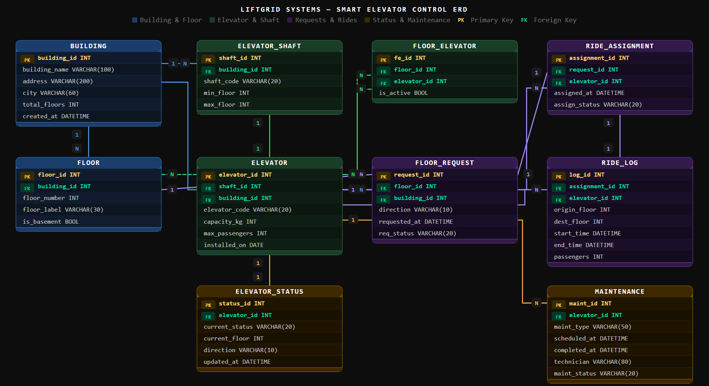

# LiftGrid Systems — Smart Elevator Control ERD

## Overview
ER Diagram for LiftGrid Systems, an intelligent elevator control platform
managing multiple buildings, elevator shafts, floor requests, ride assignments
and maintenance tracking across large commercial buildings in India.

## ER Diagram

## Entities

| Entity | Theme | Description |
|---|---|---|
| BUILDING | Building | Top-level entity — each commercial property |
| FLOOR | Building | Floors belonging to a building |
| ELEVATOR_SHAFT | Elevator | Physical shaft inside a building |
| ELEVATOR | Elevator | One elevator per shaft, config data only |
| ELEVATOR_STATUS | Status | Real-time state: idle / moving / maintenance |
| FLOOR_ELEVATOR | Junction | Many-to-many: floors ↔ elevators |
| FLOOR_REQUEST | Request | Passenger request generated from a floor |
| RIDE_ASSIGNMENT | Request | Elevator assigned to handle a request |
| RIDE_LOG | Rides | Completed trip record for analytics |
| MAINTENANCE | Maintenance | Full history of maintenance per elevator |

## Key Design Decisions

- **Elevator config vs activity separated** — static data (capacity, install date)
  stays in ELEVATOR; dynamic ride data lives in RIDE_LOG
- **ELEVATOR_STATUS is its own table** — real-time state never overwrites history
- **FLOOR_ELEVATOR junction** — handles many-to-many between floors and elevators
- **Request → Assignment → Log chain** — clean 3-step flow, fully traceable
- **Maintenance is append-only** — every service record is preserved, never overwritten
- **One elevator per shaft** — enforced by 1:1 between ELEVATOR_SHAFT and ELEVATOR

## Relationships Summary

| From | To | Type |
|---|---|---|
| BUILDING | FLOOR | 1 to N |
| BUILDING | ELEVATOR_SHAFT | 1 to N |
| ELEVATOR_SHAFT | ELEVATOR | 1 to 1 |
| ELEVATOR | ELEVATOR_STATUS | 1 to 1 |
| FLOOR + ELEVATOR | FLOOR_ELEVATOR | Many to Many (junction) |
| FLOOR | FLOOR_REQUEST | 1 to N |
| FLOOR_REQUEST | RIDE_ASSIGNMENT | 1 to 1 |
| ELEVATOR | RIDE_ASSIGNMENT | 1 to N |
| RIDE_ASSIGNMENT | RIDE_LOG | 1 to 1 |
| ELEVATOR | MAINTENANCE | 1 to N |
